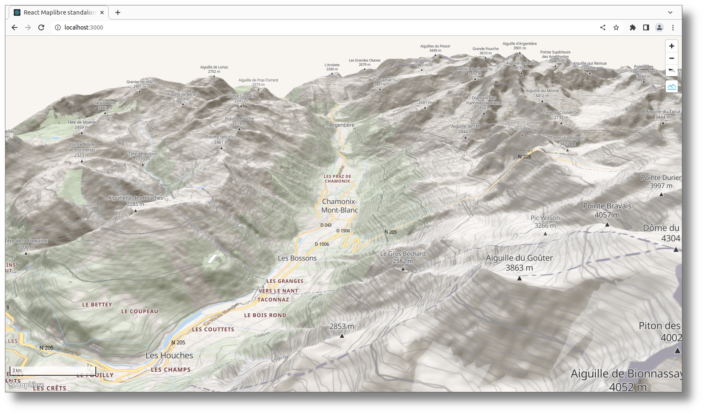
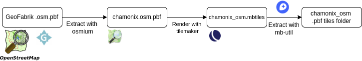
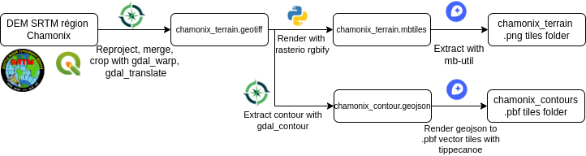
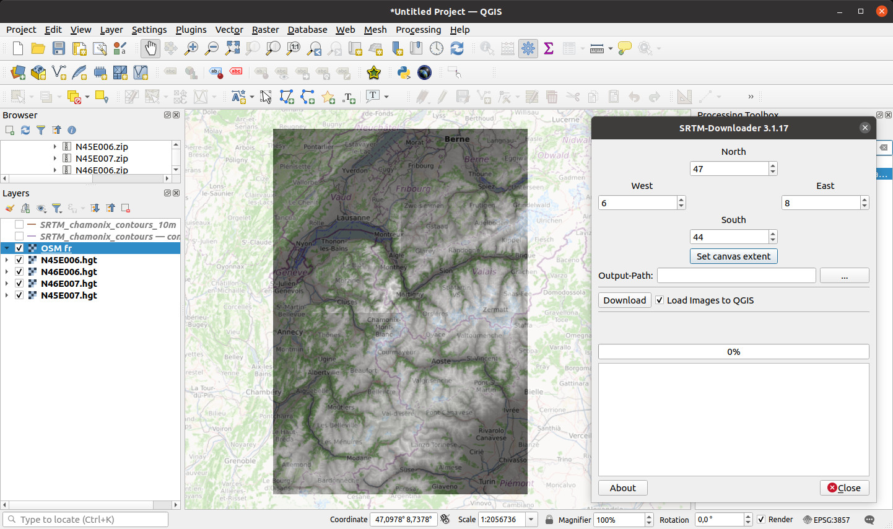
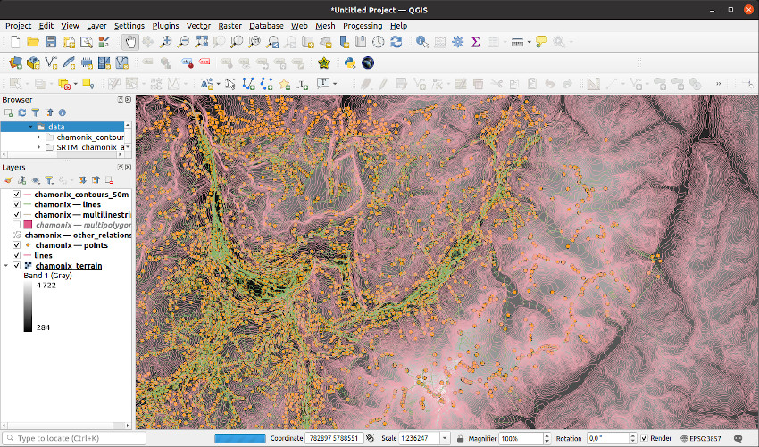
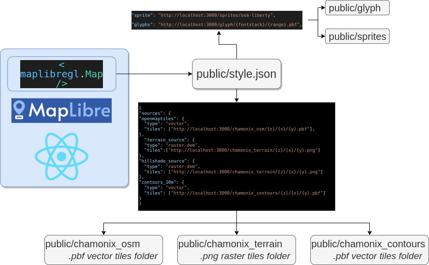

# Standalone React Maplibre visualization

<p align="center">


<p align="center">

<p align="center">
 &nbsp; 
 &nbsp;  &nbsp;  &nbsp; 
 
</p>

[](https://creativecommons.org/licenses/by/4.0/)

`react-maplibre-standalone` is a React MapLibre visualization sample using only local GIS data with no API-key or any third-party service dependency. Repository could be used as a sample for a standalone map visualization application or in an airgapped environment. This tutorial is a Work In Progress, see the openned Github issues.

React integration is a Typescript / @emotion adaptation of the excellent [MapTiler](https://www.maptiler.com/) tutorial: https://docs.maptiler.com/react/maplibre-gl-js/how-to-use-maplibre-gl-js/  (MIT, (C) MapTiler)

Our objective is to build a Maplibre web application with the following features:
  1. A vector OSM layer.
  2. A terrain digital elevation model to view a vector OSM layer in 3D with hill-shading.
  3. A terrain contour model since this is an "outdoor" oriented application.

`react-maplibre-standalone` is built with ready to use pre-processed data:

```
git clone https://github.com/cneben/react-maplibre-standalone
cd react-maplibre-standalone
npm install
npm run dev
```

Web application should then be available at: http://localhost:3000  (Note: port 3000 is hardcoded in `style.json` it must be free)

This README.md describe the process for generating your own GIS data:




External resources:
  - https://blog.kleunen.nl/blog/tilemaker-generate-map
  - Contour lines:
    - https://github.com/nst-guide/terrain
    - https://github.com/nst-guide/contours

Demonstration is centered on Chamonix since it offer both a dense urban environment and interesting terrain features:
  - Map is centered on: `$CENTER = [45.92, 6.87]` in decimal degrees.
  - All layers are cropped around Chamonix using the following bounding box: `$BBOX = [6.54, 46.04, 7.16, 45.77]`.
  - Zoom will be `[0, 16]`.

```
 .
 +-- data/                         # Used to generate gis data
 |   +-- tilemaker/
 +-- react-maplibre-standalone/    # Git clone of this repository
     +-- public/
```

This tutorial is tested on an Ubuntu 20.04 system with GDAL 3.0.4 and QGIS 3.26.1:
```
sudo apt-get install gdal-bin
ogrinfo --version
GDAL 3.0.4, released 2020/01/28
```

## OSM vector layer:


### Create a .osm for target area

There is significant limitations on API calls volume you can do on openstreetmap.org, extracting a large area to `.osm` XML/vector format might be tricky. 

A more robust procedure is to download a regional `.pbf` extract from GeoFabrik and crop this extract to the desired bounding box before converting resulting `.pbf` to a `.osm` file with `osmium`.

For Chamonix, the `rhone-alpes-latest.osm.pbf` regional `.pbf` extract can be downloaded directly from [GeoFabrik](https://download.geofabrik.de/):

```
wget https://download.geofabrik.de/europe/france/rhone-alpes-latest.osm.pbf
sudo apt install osmium-tool
osmium extract --set-bounds -b 6.54,46.04,7.16,45.77 rhone-alpes-latest.osm.pbf -o chamonix_osm.pbf
```
`osmium` arguments:
- `--set-bounds` is a mandatory option: without a global bounding box being added to output `.pbf`, `tilemaker` tool will fail with the following error: _"Can't read shapefiles unless a bounding box is provided"_. 

- `.pbf`: Usually vector tiles serialized in Protocol Buffer format.
- `.mbtiles`: MabBox Tiles, a sqlite3 container for a regular Z/X/Y tiles directory (plus metadata), tiles can be raster (PNG, ...) or vector (PBF).


### Convert .osm to .pbf vector tiles:

OSM pbf extract must be converted to vector tiles in a Maplibre compliant format: `tilemaker` (https://github.com/systemed/tilemaker) tool is able to generate theses tiles using a JSON input configuration

From `data` directory, `tilemaker` could be installed with:
```
git clone git@github.com:systemed/tilemaker.git
cd tilemaker
sudo apt install build-essential libboost-dev libboost-filesystem-dev libboost-iostreams-dev libboost-program-options-dev libboost-system-dev liblua5.1-0-dev libprotobuf-dev libshp-dev libsqlite3-dev protobuf-compiler rapidjson-dev
make
sudo make install
```
`tilemaker` need additional data for processing coastlines and landuse, this data is not packaged in `chamonix_osm.pbf` and need to be downloaded from OSMData and NaturalEarth:

Install landuse vectors from NaturalEarth:
```
wget https://github.com/nvkelso/natural-earth-vector/archive/refs/tags/v5.1.2.zip
unzip v5.1.2.zip
mkdir -p landcover/ne_10m_urban_areas
cp natural-earth-vector-5.1.2/10m_cultural/ne_10m_urban_areas.* landcover/ne_10m_urban_areas
mkdir -p landcover/ne_10m_antarctic_ice_shelves_polys
cp natural-earth-vector-5.1.2/10m_physical/ne_10m_antarctic_ice_shelves_polys.* landcover/ne_10m_antarctic_ice_shelves_polys
mkdir -p landcover/ne_10m_glaciated_areas
cp natural-earth-vector-5.1.2/10m_physical/ne_10m_glaciated_areas.* landcover/ne_10m_glaciated_areas
```

Install coastlines vectors:
```
wget https://osmdata.openstreetmap.de/download/water-polygons-split-4326.zip
unzip water-polygons-split-4326.zip
mv water-polygons-split-4326 coastline
```

You should now have `coastline` and `landcover` folders. See this blog post for more details: https://smellman.hatenablog.com/entry/2021/12/31/175657.

```
 .
 +-- data/
 |   +-- landcover/
 |   +-- coastline/
 |   +-- tilemaker-config-standalone.json    # Available from this repository config/ folder
 |   +-- chamonix_osm.pbf                    # Input OSM file
 |   +-- tilemaker/
```

It is possible to convert you `chamonix_osm.pbf` to a vector `.mbtiles`, but a specific configuration must be provided to `tilemaker`:

```sh
tilemaker --input chamonix.osm.pbf --output chamonix_osm.mbtiles --process ./tilemaker/resources/process-openmaptiles.lua --config ./tilemaker-config-standalone.json
```

Default `./tilemaker/resources/config-openmaptiles.json` is working fine, but tiles compression should be disabled for offline use (See [this]( https://github.com/mapbox/tippecanoe/issues/793) github issue):

```json
  "compress": "none"
```

Since we are "server less", maplibre can't directly render `.mbtiles` and our tiles must be "unpackaged" to a simple Z/X/Y folder structure using `mb-util`:

Extract mbtiles to OSM vector pbf Z/X/Y folders:
```sh
mb-util --image_format=pbf chamonix_osm.mbtiles chamonix_osm
```

*References:*
  - "3D Terrain in MapLibre 2.2": https://www.youtube.com/watch?v=sjf4GNaHtpY
  - "Tilemaker Tips": https://www.youtube.com/watch?v=q8mnyV7be1c

## Terrain DEM


### Data source

For simplicity the well known USGS SRTM DEM tiles has been selected and can be downloaded directly from QGis using the "SRTM Downloader" plugin. You need to register to EarthData (https://www.earthdata.nasa.gov/) and provide your user/password to STRM Downloader plugin: 



Using the Chamonix BBOX, you should end up with 4 `.hgt` files that are easy to process with GDal.

We have been very successful with other DEM sources:
  - **Worldwide**: 
    - **Japan PALSAR2** https://www.eorc.jaxa.jp/ALOS/en/dataset/fnf_e.htm (approx 25m resolution).
  - **Europe**: 
    - https://land.copernicus.eu/imagery-in-situ/eu-dem/eu-dem-v1.1
  - **France**: 
    - **IGN / BD ALTI**: https://geoservices.ign.fr/bdalti (approx 25m resolution)

### Process SRTM to GeoTIFF

The more effective way is to build a GDAL VRT (Virtual format) to merge our multiple `.hgt` in a single project file. This virtual project can then be re-projected and interpolated to WGS84 using `gdalwarp` and finally translated to a single geo tiff with `gdal_translate`:

STRM Downloader output folder is `SRTM_chamonix` (4 `.hgt` files):

```
gdalbuildvrt -overwrite -srcnodata -9999 -vrtnodata -9999 SRTM_chamonix_area.vrt SRTM_chamonix_area/*.hgt
gdalwarp -r cubicspline -t_srs EPSG:3857 -dstnodata 0 -co COMPRESS=DEFLATE SRTM_chamonix_area.vrt SRTM_chamonix_area_WGS84.vrt
gdal_translate -of GTiff -co COMPRESS=LZW -co BIGTIFF=YES -co TILED=YES SRTM_chamonix_area_WGS84.vrt chamonix_area.tiff
```

This large area DEM must be cropped to our vector OSM layer boundaries. OSM layer bounding box can be extracted with `osmium fileinfo` command and the crop is then applied using `gdalwarp` with an input bbox in correct SRS:

```sh
$ osmium fileinfo chamonix_osm.pbf
...
Header:
  Bounding boxes:
    (6.54,45.77,7.16,46.04)
```
Remove `,` in `gdalwarp` input:
```
gdalwarp -te 6.54 45.77 7.16 46.04 -te_srs EPSG:4326 chamonix_area.tiff chamonix_terrain.tiff
```

Ouput product `chamonix_terrain.tiff` will be used to render elevation tiles and build a vector contour lines layer.

*Note:* `gdalwarp [-te xmin ymin xmax ymax]` need a box in source SRS (EPSG:3857), get the value in QGIS/Layer properties/metadata/extent the `osimum` bound need to be re-ordered and converted from decimal degrees.

*References:*
  - https://joeyklee.github.io/broc-cli-geo/guide/XX_raster_cropping_and_clipping.html

### Process GeoTIFF to elevation tiles

Geo tiff must now be converted to raster tiles compatibles with Maplibre terrain layers. [`rasterio`](https://github.com/rasterio/rasterio) [`rgbify`](https://github.com/mapbox/rio-rgbify) tool is used to generate a `.mbtiles`:

Install `rasterio`:
```
python3 -m pip3 install rasterio==1.2.0
rio --version
```

Generate elevation image tiles from `.tiff` raster:

```
rio rgbify -b -10000 -i 0.1 --min-z 0 --max-z 12 -j 8 --format png chamonix_terrain.tiff chamonix_terrain.mbtiles
```

Use `--format webp` to use more compression.

| **Format** | **PNG** | **WEBP** |
|------------|---------|----------|
| Size (mb)  | 33.2mb  |  21.3mb  |

There is an issue with rio-rgbify > 1.2.0, see https://github.com/mapbox/rio-rgbify/issues/39

Tiles can be extracted to a png Z/X/Y folder using mb-util:
```
mb-util --image_format=png chamonix_terrain.mbtiles chamonix_terrain
```

*References:*
  - https://makina-corpus.com/sig-webmapping/optimisation-tuiles-mnt-rgb-ombrage-dynamique-mapbox-gl-maplibre-gl


### Contour lines generation

There is two Github references repositories to generate terrain contour:
- https://github.com/nst-guide/terrain
- https://github.com/nst-guide/contours

Unfortunately, we have not been successful with their `ogr2ogr` method:
```
ogr2ogr -f GeoJSONSeq -sql 'SELECT * FROM Elev_Contour WHERE ContourElevation % 40 = 0.0' $geojson_name $elev_file
```

Contour lines could be generated manually using `gdal_contour` and `tippecanoe`:

```
gdal_contour -a height -i 50 chamonix_terrain.tiff -f GeoJSONSeq chamonix_contours_50m.geojson
```
`gdal_contour` main arguments:
  - `-a height`: Export and `height` (ie elevation) argument for every polylines (in meters). Must be consistent with tippecanoe `-y` argument.
  - `-i 50`: Generate a polyline every 50 meters.
  - `gdal_contour` default output is `.shp`, exporting directly to geojson avoid an `ogr2ogr` call.

`tippecanoe` is easy to build and install on Ubuntu:

```
sudo apt-get install build-essential libsqlite3-dev zlib1g-dev
git clone https://github.com/mapbox/tippecanoe.git
cd tippecanoe
make -j
make install
```

Then, your `chamonix_contours_50m.geojson` is converted to pbf vector tiles with `tippecanoe`:

```
tippecanoe --no-feature-limit --no-tile-size-limit --exclude-all --minimum-zoom=1 --maximum-zoom=11 --no-tile-compression  -y height -l contours --force --output-to-directory "chamonix_contours_50m" chamonix_contours_50m.geojson 
```

`tippecanoe` main arguments:
  - `--no-tile-compression`: gzip unsupported with serverless direct tiles access.
  - `-y height`: used in `style.json`.
  - `-l contours`: Name of the contour polylines layer inside the geojson tiles, this name is reused in Maplibre `style.json` contour layers configuration.

You should end up with a plain `.pbf` directory: `chamonix_coutours_50m` (use mb-util to generate a `.mbtiles`).

> [!NOTE]
> Since v4.1.3 Maplibre a new option is available for generating coutour lines on the fly from DEM sources:
> https://maplibre.org/news/2024-04-30-maplibre-newsletter-april-2024/#maplibre-style-spec
> ; Issue is also active: https://github.com/maplibre/maplibre-style-spec/issues/583

## "Serverless" visualization in Maplibre

Full dataset should look like:



By serverless we mean:
  - A web application built using `npm build`, then served using only a web server (ie, no GIS server for serving mbtiles such as [`tileserver-gl`](https://github.com/maptiler/tileserver-gl) or [`mbtilesserver`](https://github.com/consbio/mbtileserver)
  - A "native" application embedding this web application with it's own resource/asset system (such as a c++ Qt application with QWebEngine serving data using Qt resources).



*Reference:*
  - https://medium.com/@ty2/how-to-display-offline-maps-using-maplibre-mapbox-39ad0f3c7543

### Create glyph and sprites resources:

Fonts are generated from [openmaptiles fonts](https://github.com/openmaptiles/fonts):
```
git clone git@github.com:openmaptiles/fonts.git
cd fonts
npm install
node generate.js
```
Resulting fonts should be copied to `public/fonts`.

Sprites have not been generated but copied directly from [osm-liberty](https://github.com/maputnik/osm-liberty) (CC-BY 4.0), the following `style.json` configuration could be used:

```json
{
  "sprite": "http://localhost:3000/sprites/osm-liberty",
  "glyphs": "http://localhost:3000/fonts/{fontstack}/{range}.pbf",
}
```

### Create a custom style

Our base style is [osm-bright](https://github.com/openmaptiles/osm-bright-gl-style) (BSD3) from OpenMapTiles.

See [public/syle.json](https://github.com/cneben/react-maplibre-standalone/blob/master/public/style.json)

```json
{
  ...
  "sources": {
    "terrain_source": {
			"type":  "raster-dem",
      "tiles": ["http://localhost:3000/chamonix_terrain/{z}/{x}/{y}.png"],
      "minzoom": 0,
      "maxzoom": 12
		},
		"hillshade_source": {
			"type":  "raster-dem",
      "tiles": ["http://localhost:3000/chamonix_terrain/{z}/{x}/{y}.png"],
      "minzoom": 0,
      "maxzoom": 12
		},
    "openmaptiles": {
      "type": "vector",
      "tiles": ["http://localhost:3000/chamonix_osm/{z}/{x}/{y}.pbf"],
      "minzoom": 0,
      "maxzoom": 16,
      "bounds": [6.540000, 45.770000, 7.160000, 46.040000]
    },
    "terrain_contours_50m": {
      "type": "vector",
      "tiles": ["http://localhost:3000/chamonix_contours_50m/{z}/{x}/{y}.pbf"],
      "minzoom": 0,
      "maxzoom": 11
    }
  },
  ...
}
```

Manually configuring `minzoom`, `maxzoom` and `bounds` is recommended to avoid 404 errors, theses values are easilly extracted from `metadata.json` file in tiles folder root directory. `openmaptiles` name should not be changed, it is referred in all layers configuration.

Once sources are configured, a special vector layers must be created for contours visualization, this configuration has been adapted from [maptiler-terrain-gl-style](https://github.com/openmaptiles/maptiler-terrain-gl-style) (BSD3) and merged in this sample "bright" fork:

```json
  "layers": [
  {
    "id": "contour_index",
    "type": "line",
    "source": "terrain_contours_50m",
    "source-layer": "contours",
    "filter": ["all", ["==", ["%", ["get", "height"], 500], 0]],
    "layout": { "visibility": "visible" },
    "paint": { ... }
  }, ...
  ]
```

Note that `source-layer` must be the `-l` argument used in `tippecanoe`. Our filter will generate a bold "contour index line" every 500m (ie where `height % 500 == 0`).

## Perspectives

- FIX issue #1 (railways not visible).
- Build a docker image and scripts for data pre-processing.
- Docker deployment with production nginx configuration.
- Docker deployment with an mbtiles server configuration.
            
## Licences

OpenMapTiles is Copyright (c) 2022, MapTiler.com & OpenMapTiles contributors
MapLibre GL JS is Copyright (c) 2020, MapLibre contributors

Map data from OpenStreetMap, (c) OpenStreetMap contributors.

This work is licensed under a Creative Commons Attribution 4.0 International License. See [LICENSE](LICENSE).


